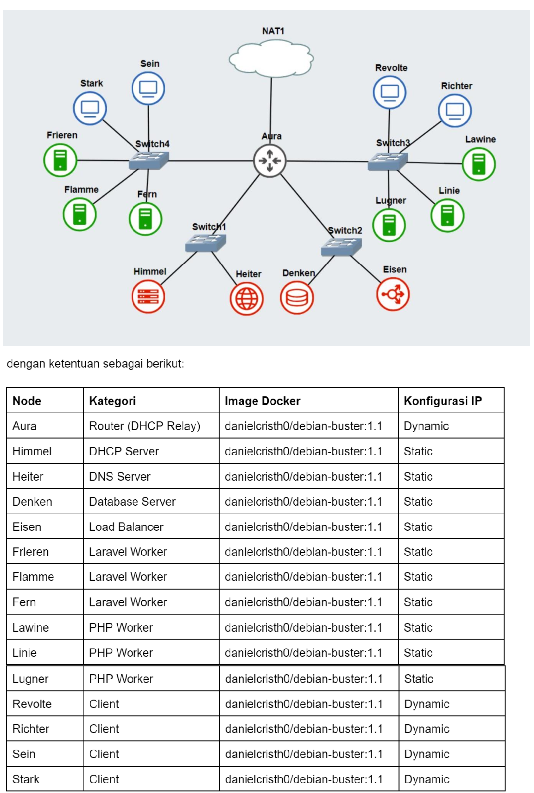
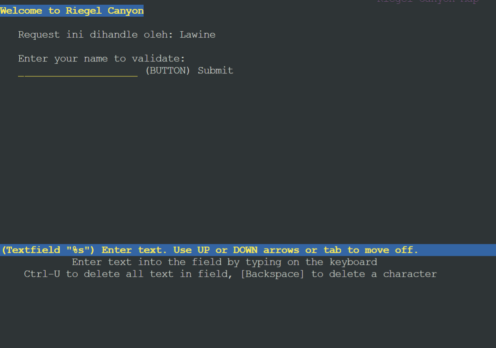
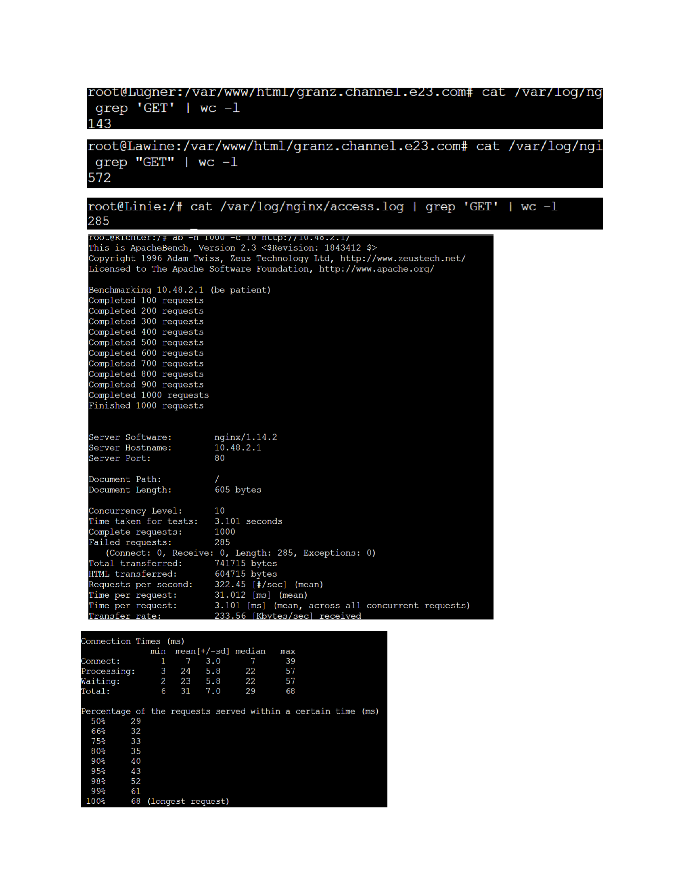

# Jarkom-Modul-3-E23-2023

Laporan Resmi Praktikum Jaringan Komputer Modul 3
***
## Anggota Kelompok
1. Ilham Insan Wafi (5025211255)
2. Elmira Farah Azalia (5025211197)



---
### Soal 0
---
> Setelah mengalahkan Demon King, perjalanan berlanjut. Kali ini, kalian diminta untuk melakukan register domain berupa riegel.canyon.yyy.com untuk worker Laravel dan granz.channel.yyy.com untuk worker PHP (0) mengarah pada worker yang memiliki IP [prefix IP].x.1.
---
### Jawaban
---
```
nano /root/.bashrc
```

- isi file seperti berikut:
```
apt update
apt install bind9 -y

echo ‘
zone “canyon.e23.com” {
	type master;
	file “/etc/bind/jarkom/canyon.e23.com”;
};

zone “channel. e23.com”{
	type master;
	file “/etc/bind/jarkom/channel. e23.com”;
};’  > /etc/bind/named.conf.local

mkdir -p /etc/bind/jarkom

echo ‘
;
; BIND data file for local loopback interface
;
$TTL    604800
@       IN      SOA    canyon. e23.com. root.canyon. e23.com. (
                              2         ; Serial
                         604800    ; Refresh
                          86400     ; Retry
                        2419200   ; Expire
                         604800 )    ; Negative Cache TTL
;
@       IN      NS     canyon.e23.com.
@       IN      A       10.48.2.1; IP Load Balancer
riegel  IN      A       10.48.3.1’ > /etc/bind/jarkom/canyon. e23.com
echo ‘
;
; BIND data file for local loopback interface
;
$TTL    604800
@       IN      SOA    channel. e23.com. root.channel. e23.com. (
                              2         ; Serial
                         604800    ; Refresh
                          86400     ; Retry
                        2419200   ; Expire
                         604800 )    ; Negative Cache TTL
;
@       IN      NS     channel. e23.com.
@       IN      A       10.48.2.1; IP Load Balancer
granz  IN      A       10.48.4.1’ > /etc/bind/jarkom/channel.e23.com


echo 'options {
        directory "/var/cache/bind";

        forwarders {
                192.168.122.1;
        };

        // dnssec-validation auto;
        allow-query{any;};
        auth-nxdomain no;    # conform to RFC1035
        listen-on-v6 { any; };
}; ' >/etc/bind/named.conf.options

service bind9 start
```

---
### Soal 1
---
> Lakukan konfigurasi sesuai dengan peta yang sudah diberikan.
---
### Jawaban
---

Lakukan konfigurasi pada setiap node seperti berikut:

Pada Aura
```
auto eth0
iface eth0 inet dhcp
up iptables -t nat -A POSTROUTING -o eth0 -j MASQUERADE -s 10.48.0.0/16

auto eth1
iface eth1 inet static
	address 10.48.1.9
	netmask 255.255.255.0

auto eth2
iface eth2 inet static
	address 10.48.2.9
	netmask 255.255.255.0

auto eth3
iface eth3 inet static
	address 10.48.3.9
	netmask 255.255.255.0
	
auto eth4
iface eth4 inet static
	address 10.48.4.9
	netmask 255.255.255.0
```

Himmel
```
auto eth0
iface eth0 inet static
	address 10.48.1.1
	netmask 255.255.255.0
	gateway 10.48.1.9
```

Heiter
```
auto eth0
iface eth0 inet static
	address 10.48.1.2
	netmask 255.255.255.0
	gateway 10.48.1.9
```

Denken
```
auto eth0
iface eth0 inet static
	address 10.48.2.2
	netmask 255.255.255.0
	gateway 10.48.2.9
```

Eisen (Load Balancer)
```
auto eth0
iface eth0 inet static
	address 10.48.2.1
	netmask 255.255.255.0
	gateway 10.48.2.9

```

Semua Client Configuration
```
auto eth0
iface eth0 inet dhcp
```

Pada DHCP Server
```
nano root/.bashrc
apt update
apt install isc-dhcp-server -y
//echo ‘INTERFACESv4=”eth0”’ > /etc/default/isc-dhcp-server
//service isc-dhcp-server start
```

---
### Soal 2, 3, 4, 5
---
> Kemudian, karena masih banyak spell yang harus dikumpulkan, bantulah para petualang untuk memenuhi kriteria berikut.:
> - Semua CLIENT harus menggunakan konfigurasi dari DHCP Server.
> - Client yang melalui Switch3 mendapatkan range IP dari [prefix IP].3.16 - [prefix IP].3.32 dan [prefix IP].3.64 - [prefix IP].3.80 (2)
> - Client yang melalui Switch4 mendapatkan range IP dari [prefix IP].4.12 - [prefix IP].4.20 dan [prefix IP].4.160 - [prefix IP].4.168 (3)
> - Client mendapatkan DNS dari Heiter dan dapat terhubung dengan internet melalui DNS tersebut (4)
> - Lama waktu DHCP server meminjamkan alamat IP kepada Client yang melalui Switch3 selama 3 menit sedangkan pada client yang melalui Switch4 selama 12 menit. Dengan waktu maksimal dialokasikan untuk peminjaman alamat IP selama 96 menit (5)
---
### Jawaban
---
Ubah konfigurasi semua client dengan konfigurasi DHCP Server
```
auto eth0
iface eth0 inet dhcp
```

Pada DHCP Server
```
echo ‘
subnet 10.48.1.0 netmask 255.255.255.0 {
}

subnet 10.48.2.0 netmask 255.255.255.0 {
}

subnet 10.48.3.0 netmask 255.255.255.0 {
range 10.48.3.16 10.48.3.32;
range 10.48.3.64 10.48.3.80;
option routers 10.48.3.9;
option broadcast-address 10.48.3.255;
option domain-name-servers 10.48.1.2;
default-lease-time 180;
max-lease-time 5760;	
}
subnet 10.48.4.0 netmask 255.255.255.0 {
	range 10.48.4.12 10.48.4.20;
range 10.48.4.160 10.48.4.168;
option routers 10.48.4.9;
option broadcast-address 10.48.4.255;
option domain-name-servers 10.48.1.2;
default-lease-time 720;
max-lease-time 5760;
}’ > /etc/dhcp/dhcpd.conf

service isc-dhcp-server restart
```

Pada Aura
```
nano root/.bashrc
```

Isi file root/.bashrc
```
apt update
apt install isc-dhcp-relay -y
SERVERS="10.48.1.1" # IP Dhcp server
INTERFACES="eth1 eth2 eth3 eth4”
```

Kemudian /etc/sysctl.conf, enable ip4 forwarding (uncomen syntax forwarding)
```
net.ipv4.ip_forward=1
service isc-dhcp-relay start
```

Kembali pada DHCP Server
```
echo ‘
host Lawine{
	hardware ethernet 7e:58:d8:55:f1:8e;
	fixed-address 10.48.3.1;
}
host Linie{
	hardware ethernet 6a:a0:56:8d:35:a8;
	fixed-address 10.48.3.2;
}
host Lugner{
	hardware ethernet b2:8e:86:ed:a6:94;
	fixed-address 10.48.3.3;
}
host Frieren{
	hardware ethernet 6e:16:c8:77:a5:6c;
	fixed-address 10.48.4.1;
}
host Flamme{
	hardware ethernet 5a:90:d0:d2:35:d5;
	fixed-address 10.48.4.2;
}
host Fern{
	hardware ethernet 56:17:50:e0:92:fc;
	fixed-address 10.48.4.3;
}’ >> /etc/dhcp/dhcpd.conf
```

Tambahkan format fixed address configuration:
```
auto eth0
iface eth0 inet dhcp
hwaddress ether 2a:39:31:ca:d4:61
```

---
Soal 6
---
> Berjalannya waktu, petualang diminta untuk melakukan deployment.
> Pada masing-masing worker PHP, lakukan konfigurasi virtual host untuk website berikut dengan menggunakan php 7.3. (6)
---
Jawaban
---
Pada semua PHP worker
```
apt update
apt install nginx -y
service nginx start
```

Pada client
```
apt update
apt install lynx -y
apt install htop -y
apt install apache2-utils -y
apt install nginx -y

nano /var/www/html
git clone -b granz https://github.com/elmirazalia/jarkom3
mv jarkom3 /var/www/html/granz.channel.e23.com
```

- Kembali pada PHP worker
```
apt-get install php php-fpm -y
```

- Cek PHP worker
```
nano /etc/nginx/sites-enabled/default
```

• Hapus server yang mencurigakan
•	Ubah /var/www/html/ granz.channel.e23.com
•	Tambah daftar index.php
•	Ganti server-name _ menjadi server-name granz.channel.e23.com
•	Uncomment beberapa bagian;
location ~ \.php$ {
    include snippets/fastcgi-php.conf;

 #With php-fpm (or other unix sockets):
    fastcgi_pass unix:/var/run/php/php7.2-fpm.sock;
   #With php-cgi (or other tcp sockets):
#fastcgi_pass 127.0.0.1:9000;
}
•	service nginx restart
•	service php7.3-fpm start

- Test pada client
```
lynx http://10.48.3.1/
```



---
Soal 7
---
> Kepala suku dari Bredt Region memberikan resource server sebagai berikut:
> a. Lawine, 4GB, 2vCPU, dan 80 GB SSD.
> b. Linie, 2GB, 2vCPU, dan 50 GB SSD.
> c. Lugner 1GB, 1vCPU, dan 25 GB SSD.
> Aturlah agar Eisen dapat bekerja dengan maksimal, lalu lakukan testing dengan 1000 request dan 100 request/second. (7)
---
Jawaban
---
- Pada Eisen (Load Balancer)
```
echo ‘nameserver 192.168.122.1’ > /etc/resolv.conf
apt update
apt install nginx -y
service nginx start
echo ‘upstream weighted {
	server 10.48.3.1 weight=4;
	server 10.48.3.2 weight=2;
	server 10.48.3.3 weight=1;
}

server {
	listen 80;
	server_name granz.channel.e23.com;
		location / {
                proxy_pass http://weighted;
                proxy_set_header    X-Real-IP $remote_addr;
                proxy_set_header    X-Forwarded-For $proxy_add_x_forwarded_for;
                proxy_set_header    Host $http_host;
        }
	error_log /var/log/nginx/lb_error.log;
access_log /var/log/nginx/lb_access.log;
}’ > /etc/nginx/sites-available/lb-jarkom

unlink /etc/nginx/sites-enabled/default
ln -s /etc/nginx/sites-available/lb-jarkom /etc/nginx/sites-enabled/default
service nginx restart
```

- Pada client
```
ab -n 1000 -c 100 http://10.48.2.3/
```

- Pada worker
```
cat /var/log/nginx/access.log | grep “GET” | wc -l
```


---
Soal 8
---
> Karena diminta untuk menuliskan grimoire, buatlah analisis hasil testing dengan 200 request dan 10 request/second masing-masing algoritma Load Balancer dengan ketentuan sebagai berikut:
> a. Nama Algoritma Load Balancer
> b. Report hasil testing pada Apache Benchmark
> c. Grafik request per second untuk masing masing algoritma. 
> d. Analisis (8)
---
Jawaban
---
Pada Round Robin
```
upstream round{
        server 10.48.3.1;
        server 10.48.3.2;
        server 10.48.3.3;
}
```

Pada Weighted Round Robin
```
upstream round{
        server 10.48.3.1;
        server 10.48.3.2;
        server 10.48.3.3;
}
```

Pada Least Connection
```
upstream least{
        least_conn;
        server 10.48.3.1;
        server 10.48.3.2;
        server 10.48.3.3;
}
```

Pada IP Hash
```
upstream least{
        ip_hash;
        server 10.48.3.1;
        server 10.48.3.2;
        server 10.48.3.3;
}
```

Pada Generic Hash
```
upstream least{
        hash $request_uri consistent;
        server 10.48.3.1;
        server 10.48.3.2;
        server 10.48.3.3;
}
```

Kemudian lanjutkan code, 

```
server {
        listen 80;
        server_name granz.channel.e23.com;
                location / {
                proxy_pass http://robin;
                proxy_set_header    X-Real-IP $remote_addr;
                proxy_set_header    X-Forwarded-For $proxy_add_x_forwarded_for;
                proxy_set_header    Host $http_host;
        }
        error_log /var/log/nginx/lb_error.log;
access_log /var/log/nginx/lb_access.log;
}
```

---
Soal 9
---
> Dengan menggunakan algoritma Round Robin, lakukan testing dengan menggunakan 3 worker, 2 worker, dan 1 worker sebanyak 100 request dengan 10 request/second, kemudian tambahkan grafiknya pada grimoire. (9)
---
Jawaban
---
Pada 3 Worker
```
upstream robin {
        server 10.48.3.1;
        server 10.48.3.2;
        server 10.48.3.3;
}
```

Pada 2 Worker
```
upstream robin {
        server 10.48.3.1;
        server 10.48.3.2;
}
```

Pada 1 worker
```
upstream robin {
        server 10.48.3.1;
}
```

Kemudian lanjutkan code;
```
server {
        listen 80;
        server_name granz.channel.e23.com;
                location / {
                proxy_pass http://robin;
                proxy_set_header    X-Real-IP $remote_addr;
                proxy_set_header    X-Forwarded-For $proxy_add_x_forwarded_for;
                proxy_set_header    Host $http_host;
        }
        error_log /var/log/nginx/lb_error.log;
access_log /var/log/nginx/lb_access.log;
}
```

Lalu unlink
```
unlink /etc/nginx/sites-enabled/default
ln -s /etc/nginx/sites-available/[nama-file] /etc/nginx/sites-enabled/default
service nginx restart
```

---
Soal 10
---
> Selanjutnya coba tambahkan konfigurasi autentikasi di LB dengan dengan kombinasi username: “netics” dan password: “ajkyyy”, dengan yyy merupakan kode kelompok. Terakhir simpan file “htpasswd” nya di /etc/nginx/rahasisakita/ (10)
---
Jawaban
---
Tambahkan konfigurasi autentikasi dalam Load Balancer
```
mkdir /etc/nginx/rahasiakita
htpasswd -c /etc/nginx/rahasiakita/.htpasswd netics
Pass: ajka02
```

Command algoritma round robin weighted 
```
echo 'upstream weighted {
    server 10.48.3.1 weight=4;
    server 10.48.3.2 weight=2;
    server 10.48.3.3 weight=1;
}

server {
    listen 80;
    server_name granz.channel.e23.com;

    location / {
        proxy_pass http://weighted;
        proxy_set_header X-Real-IP $remote_addr;
        proxy_set_header X-Forwarded-For $proxy_add_x_forwarded_for;
        proxy_set_header Host $http_host;

        auth_basic "Administrator'\''s Area";
        auth_basic_user_file /etc/nginx/etc/nginx/rahasiakita/.htpasswd;
    }

    location ~ /\.ht {
        deny all;
    }

    error_log /var/log/nginx/lb_error.log;
    access_log /var/log/nginx/lb_access.log;
}' > /etc/nginx/sites-available/lb-jarkom

unlink /etc/nginx/sites-enabled/default
ln -s /etc/nginx/sites-available/lb-jarkom3 /etc/nginx/sites-enabled/default
service nginx restart
```

Jalankan command berikut pada client
```
ab -A netics:ajka02 -n 100 -c 100 http://granz.channel.e23.com/
```

---
Soal 11
---
> Lalu buat untuk setiap request yang mengandung /its akan di proxy passing menuju halaman https://www.its.ac.id. (11) hint: (proxy_pass)
---
Jawaban
---
Lanjutkan code 10
```
location /its {
        proxy_pass https://www.its.ac.id;
    
	auth_basic "Administrator'\''s Area";
        auth_basic_user_file /etc/nginx/rahasiakita/.htpasswd;
}
```
Saat IP LB diakses dengan tambahan endpoint `/its`, maka akan terhubung `https://www.its.ac.id`

---
Soal 12
----
> Selanjutnya LB ini hanya boleh diakses oleh client dengan IP [Prefix IP].3.69, [Prefix IP].3.70, [Prefix IP].4.167, dan [Prefix IP].4.168. (12) hint: (fixed in dulu clinetnya)
---
Jawaban
---
Tambahkan code seperti berikut
```
 location / {
allow 10.48.3.69;
        allow 10.48.3.70;
        allow 10.48.4.167;
        allow 10.48.4.168;
        deny all;

        proxy_pass http://weighted;
        proxy_set_header X-Real-IP $remote_addr;
        proxy_set_header X-Forwarded-For $proxy_add_x_forwarded_for;
        proxy_set_header Host $http_host;

        auth_basic "Administrator'\''s Area";
        auth_basic_user_file /etc/nginx/rahasiakita/.htpasswd;
    }
```


